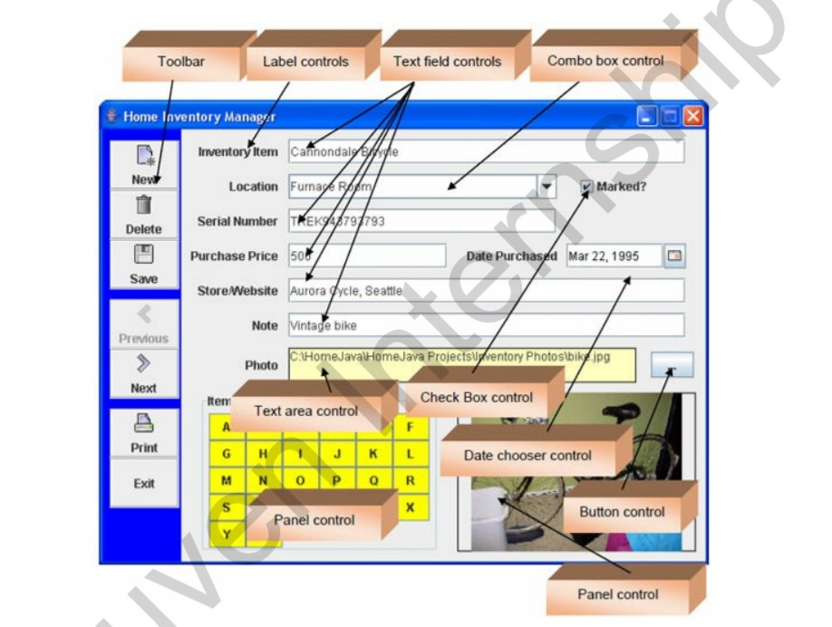
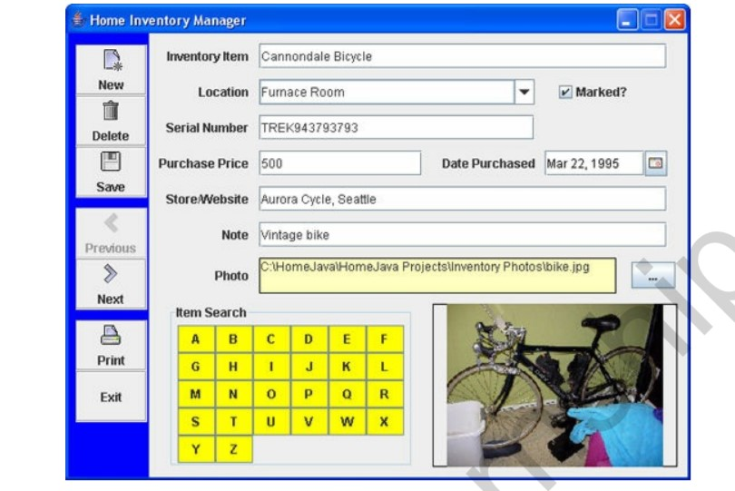
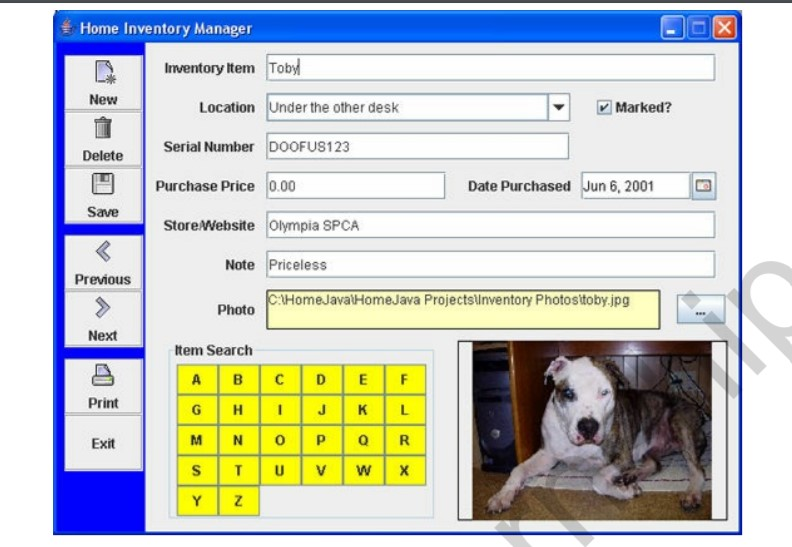
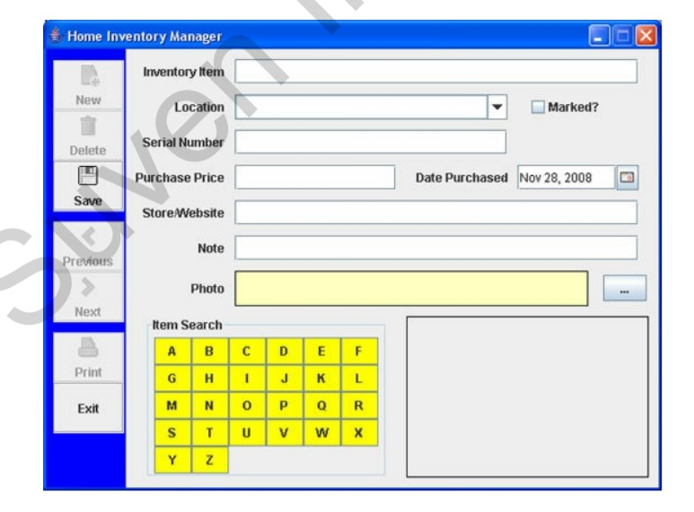
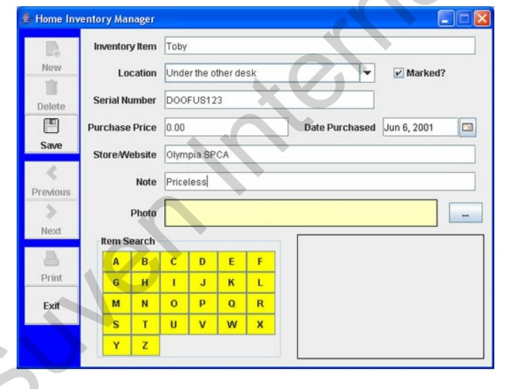
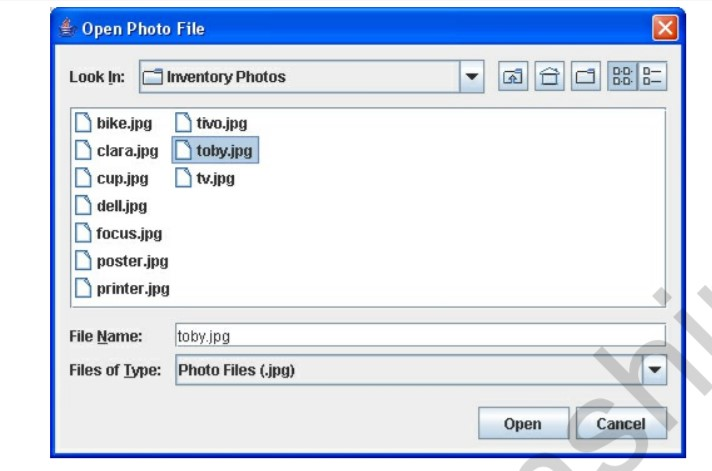
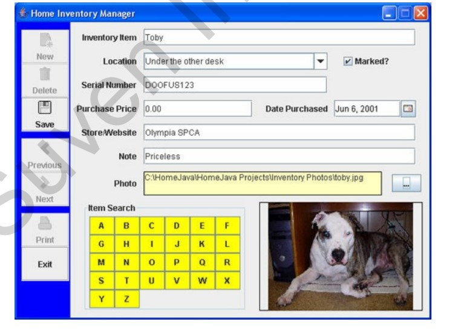

## Getting Started

# Home Inventory-Manager-Project 
 

 # Abstract
This project will help you keep a record of your belongings.
A toolbar control is used to add, delete and save items from the inventory. It is also used to
navigate from one item to the next. The primary way to enter information about an inventory item is
with several text field controls. A combo box is used to specify location, while a date chooser is
used to select purchase date. A check box control indicates if an item is marked with identifying
information.
# overview
In this project, we will build a home inventory manager program. This program lets you keep a
record of your belongings
The program has a built-in sample inventory file – the first item in that file is displayed (items are
listed alphabetically by Inventory Item):

A primary task of the home inventory manager is to add, edit, save and delete inventory items. To add
an item, you click the Add button in the toolbar. You then enter the necessary information and click the
Save button. To edit an existing item, you first display the item to edit. Make the desired changes and
click Save. To delete an item, you display the item, then click the Delete toolbar button. Let’s try the
editing features.

The finished project is saved as HomeInventory in the \HomeJava\HomeJava Projects\ project
group. Start NetBeans (or your IDE). Open the specified project group. Make HomeInventory the
main project. Run the project. You will see:

 

 

On the toolbar are two buttons marked Previous and Next. Use these to move from one item to the
next. The sample file has 10 items to view. In the Item Search panel are 26 buttons, each with a
letter of the alphabet. These are used to search through the inventory for items beginning with the
clicked letter. Try searching the sample inventory, if you’d like.
 

 
Another nice feature of the project is the ability to get a printed record of your inventory. Click the
toolbar button marked Print (don’t worry, nothing will print). You will see:
This is the standard print dialog where you select printing options (including what printer to use).
Click Cancel.

 

 
A primary task of the home inventory manager is to add, edit, save and delete inventory items. To add
an item, you click the Add button in the toolbar. You then enter the necessary information and click the
Save button. To edit an existing item, you first display the item to edit. Make the desired changes and
click Save. To delete an item, you display the item, then click the Delete toolbar button. Let’s try the
editing features.
Navigate to one of the existing items in the sample file (use the Previous or Next buttons or try a
search). I moved to Toby, my ever faithful dog:
 

 
We’ll delete this item, then rebuild it to demonstrate how to enter information. Click the Delete
button – choose Yes when asked if you really want Toby to go away. The display will show the
next item in the inventory. Click the New button to start a new item.
The blank inventory screen appears as:

 

 
Under Inventory Item, type Toby and press <Enter>. This is the only required piece of information
– all other entries are optional. For Location, click the drop-down arrow in the combo box. A list of
choices is presented. Choose one of these items or type your own. If you type an entry that’s not in the
combo box, it will be added and saved for future items. Choose Under the other desk for Toby (he’s
always there). Put a check mark next to Marked? Make up a Serial Number for Toby – I used
DOOFUS123. We got Toby for free, so his Purchase Price is 0.00. We got Toby on June 6, 2001.
Under Date Purchased, click the drop-down arrow. On the calendar that appears, navigate to this
date and click it. Under Store/Website, type Olympia SPCA (he’s a pound puppy) and under Note,
type Priceless.
At this point, the form should look like this:

 

 
The last step is adding a photo.
Click the button with the ellipsis (…) next to the Photo label area. An open file dialog box will
appear:

### Note- The photo can be any JPEG file (what a digital camera uses). You simply navigate to a photo
location and click Open. The samples for these notes are in the \HomeJava\HomeJava
Projects\Inventory Photos\ folder. Move to that folder and select toby.jpg as shown. Click Open
and the photo will appear.

 

 
The final Toby inventory item page looks like this:
~Notice the photo and the file name listed under Photo. At this point, click Save and Toby is back in
the list (properly sorted alphabetically).

 

 
That’s all you do with the Home Inventory project – there’s a lot going on behind the scenes though.
That’s the idea of the program. Fill in an entry page for each item in your inventory and click Save.
Click Exit on the toolbar when done. Upon exiting the program, all your inventory items are saved to
a file (the built-in file currently holding the sample entries). This same file is automatically opened
when you rerun the program, so your items are always available for additions, changes and deletions.

## Folder Structure

The workspace contains two folders by default, where:

- `src`: the folder to maintain sources
- `lib`: the folder to maintain dependencies

## Dependency Management

The `JAVA DEPENDENCIES` view allows you to manage your dependencies. More details can be found [here](https://github.com/microsoft/vscode-java-pack/blob/master/release-notes/v0.9.0.md#work-with-jar-files-directly).
